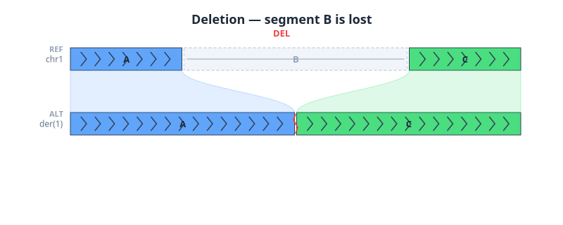
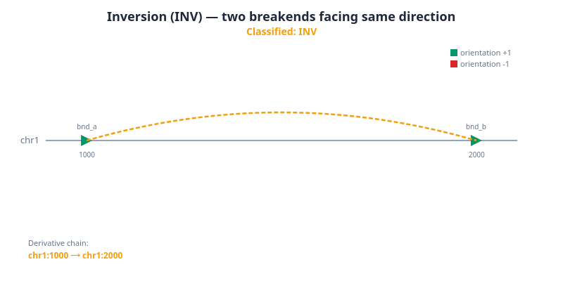
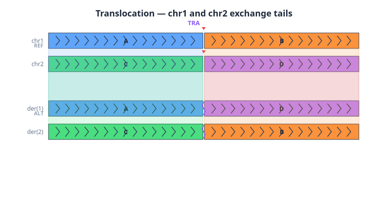
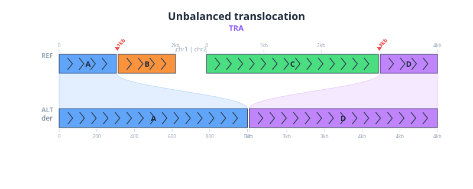
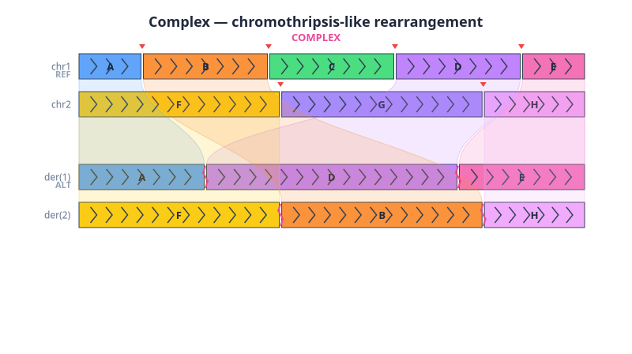

# derivative-chromosome-utils

Reconstruct derivative chromosomes from VCF breakend (BND) records.

## Overview

This library takes BND records from any VCF and reconstructs derivative
chromosomes by building a breakend graph and chaining breakend pairs into
ordered sequences of reference segments.

The algorithm is adapted from the LINX chaining approach (Hartwig Medical
Foundation) but decoupled from any specific SV caller. This code is 100% created
from Claude Code Opus 4.6. I asked it to look at how GRIDDS-PURPLE-LINX
(https://github.com/hartwigmedical/hmftools) reconstructs derivative chromosomes
from VCF breakends and extract it to a standalone utility.

## Visualizations

These diagrams are **auto-generated** from VCF fixture files using the walk
algorithm in `src/walk.ts`. Each diagram shows the reference genome (REF) on top
and the reconstructed derivative genome (ALT) below. Colored segments (A, B,
C...) represent reference regions between breakpoints. Curved ribbons connect
each segment from its reference position to its position in the derivative.
Chevrons indicate strand orientation (right-pointing = forward, left-pointing =
reversed). Dashed segments in the "other" row are orphaned or lost.

Usage:

```bash
node scripts/visualize.ts <input.vcf> <output.png> [--title "..."]
```

### Deletion

Two breakends face inward (`A[chr1:2000[` and `]chr1:1000]C`) — the reference
segment between them is lost.

```
#CHROM  POS   ID     REF  ALT            INFO
chr1    1000  bnd_a  A    A[chr1:2000[   SVTYPE=BND;MATEID=bnd_b;EVENT=del1
chr1    2000  bnd_b  C    ]chr1:1000]C   SVTYPE=BND;MATEID=bnd_a;EVENT=del1
```

Walk result: A(fwd) → C(fwd). Segment B is lost.

```bash
node scripts/visualize.ts test/fixtures/deletion.vcf img/deletion.png --title "Deletion — segment B is lost"
```



### Inversion

Four breakends (two pairs) at the same positions but opposite orientations. The
first pair (`A]chr1:2000]` / `C]chr1:1000]`) has both breakends facing right
(+1), and the second pair (`]chr1:2000]A` / `]chr1:1000]C`) has both facing left
(-1). Together they sever both sides of the segment, reversing it.

```
#CHROM  POS   ID     REF  ALT            INFO
chr1    1000  bnd_a  A    A]chr1:2000]   SVTYPE=BND;MATEID=bnd_b;EVENT=inv1
chr1    2000  bnd_b  C    C]chr1:1000]   SVTYPE=BND;MATEID=bnd_a;EVENT=inv1
chr1    1000  bnd_c  A    ]chr1:2000]A   SVTYPE=BND;MATEID=bnd_d;EVENT=inv1
chr1    2000  bnd_d  C    ]chr1:1000]C   SVTYPE=BND;MATEID=bnd_c;EVENT=inv1
```

Walk result: A(fwd) → B(rev) → C(fwd).

```bash
node scripts/visualize.ts test/fixtures/inversion.vcf img/inversion.png --title "Inversion — segment B is reversed"
```



### Balanced translocation

A reciprocal translocation requires two breakend pairs (4 records). The first
pair connects chr1:1000(+1) to chr2:3000(-1), and the second connects
chr1:1000(-1) to chr2:3000(+1). Both sides of each breakpoint are severed and
reconnected to the other chromosome.

```
#CHROM  POS   ID     REF  ALT            INFO
chr1    1000  bnd_a  A    A[chr2:3000[   SVTYPE=BND;MATEID=bnd_b;EVENT=tra1
chr2    3000  bnd_b  C    ]chr1:1000]C   SVTYPE=BND;MATEID=bnd_a;EVENT=tra1
chr1    1000  bnd_c  A    [chr2:3000[A   SVTYPE=BND;MATEID=bnd_d;EVENT=tra1
chr2    3000  bnd_d  C    C]chr1:1000]   SVTYPE=BND;MATEID=bnd_c;EVENT=tra1
```

Walk result: der 1 = A(fwd) → D(fwd), der 2 = C(fwd) → B(fwd).

```bash
node scripts/visualize.ts test/fixtures/translocation.vcf img/translocation.png --title "Balanced translocation — chr1 and chr2 exchange tails"
```



### Unbalanced translocation

Only one breakend pair — an incomplete picture. Only one derivative chromosome
can be reconstructed; the remaining tails of each chromosome are orphaned
because there is no second junction to connect them.

```
#CHROM  POS   ID     REF  ALT            INFO
chr1    1000  bnd_a  A    A[chr2:3000[   SVTYPE=BND;MATEID=bnd_b;EVENT=tra1
chr2    3000  bnd_b  C    ]chr1:1000]C   SVTYPE=BND;MATEID=bnd_a;EVENT=tra1
```

Walk result: der = A(fwd) → D(fwd). Segments B and C are orphaned.

```bash
node scripts/visualize.ts test/fixtures/unbalanced_translocation.vcf img/unbalanced_translocation.png --title "Unbalanced translocation — one junction, incomplete picture"
```



### Complex rearrangement

Three breakend pairs across two chromosomes (6 BND records). The walk algorithm
traces three derivative chains and identifies two lost segments.

```
#CHROM  POS   ID     REF  ALT            INFO
chr1    1000  bnd_a  A    A[chr1:5000[   SVTYPE=BND;MATEID=bnd_b;EVENT=cx1
chr1    5000  bnd_b  C    ]chr1:1000]C   SVTYPE=BND;MATEID=bnd_a;EVENT=cx1
chr1    3000  bnd_c  G    G[chr2:8000[   SVTYPE=BND;MATEID=bnd_d;EVENT=cx2
chr2    8000  bnd_d  T    ]chr1:3000]T   SVTYPE=BND;MATEID=bnd_c;EVENT=cx2
chr2    6000  bnd_e  A    A[chr1:7000[   SVTYPE=BND;MATEID=bnd_f;EVENT=cx3
chr1    7000  bnd_f  C    ]chr2:6000]C   SVTYPE=BND;MATEID=bnd_e;EVENT=cx3
```

Walk result: der 1 = A(fwd) → D(fwd), der 2 = B(fwd) → H(fwd), der 3 = F(fwd) →
E(fwd). Segments C and G are lost.

```bash
node scripts/visualize.ts test/fixtures/complex.vcf img/complex.png --title "Complex — chromothripsis-like rearrangement"
```



## Algorithm

### The problem

VCF breakend (BND) records describe **edges** in a genome rearrangement graph:
each pair says "these two positions are now adjacent in the sample." The goal is
to reconstruct **paths** — the linear sequence of reference segments that make
up each derivative chromosome. This is fundamentally an edge-to-path
reconstruction problem.

For simple events (a single deletion, inversion, or translocation with 2-4
breakends), the path is unambiguous — there is only one way to walk the graph.
For complex events, it is not.

### Why complex events are ambiguous

When multiple breakends cluster on the same chromosome arm, there are multiple
valid ways to pair them into "facing breakend" links. For example, four
breakends at positions 1000, 2000, 3000, 4000 could pair as (1000,2000)

- (3000,4000) or as (1000,4000) + (2000,3000), producing different derivative
  chromosomes. With N breakends the number of valid pairings grows
  combinatorially.

Additional sources of ambiguity:

- **Phasing**: Two SVs on the same haplotype (cis) chain into one derivative;
  the same SVs on different haplotypes (trans) are independent. The breakend
  graph looks identical either way.
- **Junction copy number**: A junction with JCN > 1 appears in multiple
  derivative chromosomes, making the graph a multigraph with multiple valid
  Euler decompositions.
- **Missing/false breakends**: Real SV callers have imperfect sensitivity and
  specificity, so the graph is incomplete and noisy.

### Our approach: greedy chaining with priority rules

This library uses a greedy chaining algorithm adapted from
[LINX](https://github.com/hartwigmedical/hmftools/tree/master/linx) (Hartwig
Medical Foundation), decoupled from any specific SV caller. It does **not**
guarantee the globally correct derivative chromosome — for complex events,
multiple valid reconstructions exist and the algorithm produces one plausible
solution.

The algorithm proceeds in stages:

1. **Parse and cluster**: Match BND mate pairs by MATEID. Group breakends by
   EVENT field or by proximity on the same chromosome (default 5kb threshold).

2. **Build the breakend graph**: Identify SV junction links (mate pairs),
   templated insertion (TI) links (facing breakends from different SVs where the
   lower has orientation -1 and upper has +1), and deletion bridge (DB) links
   (breakends facing away from each other).

3. **Greedy link selection**: Iteratively pick the highest-priority available TI
   link and add it to an existing chain or start a new one:
   - **ONLY**: A breakend has exactly one possible facing partner — forced
     choice. This cascades: resolving one link can force others.
   - **ADJACENT**: Facing breakends consecutive in the sorted position list (no
     other breakends between them).
   - **JCN_MATCH**: Facing breakends whose junction copy numbers match within
     uncertainty, suggesting they belong to the same derivative.
   - **NEAREST**: Closest facing pair by genomic distance (fallback).

4. **Optional CN filtering** (Tier 3): When copy number data is provided, links
   whose intervening segment has cluster allele JCN below a threshold (0.15) are
   pruned — that segment is not part of any derivative in this cluster.

5. **Chain merging and classification**: Attempt to merge chain ends that
   connect. Classify each chain as DEL, DUP, INV, TRA, or COMPLEX based on
   segment count, chromosome span, and orientations.

### Confidence by event complexity

| Complexity                | Example                  | Ambiguity           | Confidence  |
| ------------------------- | ------------------------ | ------------------- | ----------- |
| Simple (2-4 breakends)    | DEL, DUP, INV, TRA       | Unambiguous         | High        |
| Moderate (5-10 breakends) | Reciprocal + small chain | Few valid solutions | Medium-high |
| Chromothripsis (20-100+)  | Catastrophic shattering  | Many valid walks    | Low-medium  |

### What improves reconstruction

The greedy heuristic works well for most cancer genomes where the majority of
events are simple. For highly complex events, the following data sources
significantly constrain the walk:

- **Long-read phasing** (PacBio/ONT): Reads spanning multiple breakpoints
  directly resolve cis/trans and constrain pairing.
- **Assembly-confirmed links**: SV callers like GRIDSS assemble contigs across
  breakpoints. If a contig covers two breakpoints, they are definitively on the
  same derivative (no heuristic needed).
- **Hi-C data**: Proximity ligation reveals which breakpoints share a derivative
  chromosome.
- **Copy number data**: Constrains which links are valid and how many times a
  junction is traversed.

## Usage

```ts
import {
  parseVcfLines,
  deriveChromosomes,
  classifyChain,
} from 'derivative-chromosome-utils'

const lines = fs.readFileSync('variants.vcf', 'utf-8').split('\n')
const breakends = parseVcfLines(lines)
const result = deriveChromosomes(breakends)

for (const chain of result.chains) {
  console.log(classifyChain(chain), chain.segments)
}
```

With copy number data:

```ts
const result = deriveChromosomes(breakends, {
  cnSegments: [
    {
      chr: 'chr1',
      start: 0,
      end: 50000000,
      majorAlleleCN: 2,
      minorAlleleCN: 1,
    },
  ],
})
```

## Limitations of the breakend representation

VCF breakend notation is the most expressive SV representation in the VCF
specification — it can describe any rearrangement, not just interval-based
events like deletions and duplications. But it has a fundamental limitation:
**BND records encode pairwise adjacencies (edges in a graph), not paths through
that graph.** Reconstructing derivative chromosomes requires solving an
edge-to-path problem that is underdetermined for complex events.

### What BND records do not tell you

**Which haplotype a junction belongs to.** The GT field can indicate
heterozygosity (0/1) but does not link two heterozygous BND pairs to the same
haplotype. Two SVs called as 0/1 might be cis (on the same derivative, chaining
together) or trans (on opposite haplotypes, producing independent derivatives).
The breakend graph looks identical in both cases.

**How junctions connect into chains.** When multiple breakends cluster on the
same chromosome arm, the VCF tells you each junction independently but not which
junctions belong to the same derivative chromosome. Four breakends with
compatible orientations can often be paired in multiple valid configurations
that produce different derivatives.

**How many times a junction is traversed.** A junction with copy number > 1
appears in multiple derivative chromosomes, but standard BND records have no
field for junction copy number. Without it, you cannot determine whether an edge
should be walked once or twice, or on how many distinct derivatives it appears.

**Assembly-level evidence linking junctions.** When an SV caller assembles a
contig spanning two breakpoints, that is definitive proof they belong to the
same derivative — the strongest possible constraint on reconstruction. But there
is no standard VCF tag to encode this. GRIDSS uses custom INFO fields (BEID,
BEIDL) that other callers and tools do not produce or consume.

### What additional data helps

Several data sources can partially resolve these ambiguities, but no single
source resolves all of them and no standard pipeline integrates them:

| Data source                                   | What it resolves                                                 | Limitation                                                                 |
| --------------------------------------------- | ---------------------------------------------------------------- | -------------------------------------------------------------------------- |
| **Long-read phasing** (PacBio/ONT)            | Cis/trans for nearby SVs; directly constrains pairing            | Requires long reads; phasing breaks down beyond read length                |
| **Assembly-confirmed links** (GRIDSS contigs) | Definitive cis evidence for breakpoint pairs spanned by a contig | Only available from assembly-capable callers; encoded in non-standard tags |
| **Hi-C contact maps**                         | Which breakpoints share a derivative chromosome (3D proximity)   | No existing tool maps Hi-C evidence back onto BND records                  |
| **Copy number segments** (PURPLE, ASCAT)      | Prunes invalid links; constrains traversal count                 | Noisy; resolution limited by bin size                                      |
| **Single-cell sequencing**                    | Resolves clonal mixtures                                         | Expensive; low coverage per cell                                           |

### Tools that would improve the situation

**Phase-aware BND annotator.** A tool that takes a BND VCF and a phased
long-read BAM, extracts reads spanning each breakpoint, phases them against a
haplotype scaffold (WhatsHap / margin), and tags each BND record with a phase
set and haplotype. This would resolve cis/trans for any caller's output.

**Multi-evidence chain constrainer.** A tool that accepts BND records plus any
combination of copy number, phasing, assembly links, and Hi-C data, and uses all
available evidence to prune the space of valid walks before running greedy
chaining. Currently each evidence type lives in a separate silo; no tool
integrates them into a unified constraint graph.

**Derivative chromosome validator.** Given a proposed chain, verify it against
read evidence: do split reads or spanning long reads actually support
consecutive junctions in the proposed order? This would assign a confidence
score to each chain and flag reconstructions that are topologically valid but
unsupported by sequence data.

### How the VCF standard could be enhanced

Human note: these suggestions are entirely AI generated. I can't verify them

Several additions to the BND specification would make reconstruction less
ambiguous without breaking backward compatibility:

**Standardize fields callers already compute internally:**

- `JCN` (junction copy number) and `JCNUNCERT` (uncertainty) as standard INFO
  fields. LINX depends on these but they are not in the spec. Any tool that
  estimates junction copy number could expose it.

- `ASSEMBLY_LINK=<mate_id>` indicating that an assembled contig spans both this
  breakpoint and another, proving they are on the same derivative.
- `CIS_LINK=<mate_id>` / `TRANS_LINK=<mate_id>` indicating phased relationships
  between SVs.

**Encode paths, not just edges:**

- A `CHAIN` INFO tag: `CHAIN=der1;CHAIN_ORDER=3;CHAIN_ORIENTATION=+` meaning
  "this BND is the 3rd junction in derivative chromosome der1, traversed in
  forward orientation." Callers that can determine paths (assembly-based
  callers, LINX) would populate this; others would omit it. Downstream tools
  could read the path directly or reconstruct from edges.

**Or move beyond VCF for complex SVs:**

GFA (Graphical Fragment Assembly) format already represents genome graphs with
segments, links, and — critically — **paths** through them. A derivative
chromosome is naturally a path in a GFA graph. Several groups have discussed
adopting graph-based formats for SV representation, which would make the
edge-to-path reconstruction problem disappear for callers that can determine
paths. The tradeoff is ecosystem adoption: the entire SV toolchain (callers,
mergers, annotators, visualizers) is built around VCF.

### An enhanced BND record might look like

```
#CHROM  POS   ID     REF  ALT            FILTER  INFO
chr1    1000  bnd_a  A    A[chr1:5000[   PASS    SVTYPE=BND;MATEID=bnd_b;JCN=1.0;CHAIN=der1;CHAIN_ORDER=1;HP=1
chr1    5000  bnd_b  C    ]chr1:1000]C   PASS    SVTYPE=BND;MATEID=bnd_a;JCN=1.0;CHAIN=der1;CHAIN_ORDER=1;HP=1
chr2    6000  bnd_e  A    A[chr1:7000[   PASS    SVTYPE=BND;MATEID=bnd_f;JCN=1.0;CHAIN=der1;CHAIN_ORDER=3;HP=1;CIS_LINK=bnd_b
chr1    7000  bnd_f  C    ]chr2:6000]C   PASS    SVTYPE=BND;MATEID=bnd_e;JCN=1.0;CHAIN=der1;CHAIN_ORDER=3;HP=1
```

A downstream tool could read the CHAIN tags and skip reconstruction entirely, or
ignore them and reconstruct from edges alone. The key point is that callers that
have path information should have a standard way to encode it, rather than
discarding it and forcing downstream tools to re-derive it heuristically.

### How simple are "simple" SVs?

Before asking whether VCF needs to change, it is worth questioning the premise
that most SVs are simple. The major biological mechanisms that produce SVs each
introduce complexity that VCF's interval-based notation tends to flatten:

- **NAHR** (non-allelic homologous recombination between repeats) produces
  deletions, duplications, and inversions — but the duplications are frequently
  inverted duplications (the new copy is in reverse orientation), and inversions
  commonly have flanking copy number changes. A "clean" inversion with precise
  breakpoints and no copy number change is actually rare.
- **FoSTeS / MMBIR** (replication-based fork stalling and template switching)
  produces inverted duplications, complex insertions, and templated insertions
  from other chromosomes. These get called as "a DUP" by short-read callers but
  are mechanistically multi-breakpoint events.
- **NHEJ** (non-homologous end joining) can produce deletions and
  translocations, but frequently with non-templated sequence inserted at the
  junction — information that VCF's simple interval notation does not capture.
- **Chromothripsis, chromoplexy, and breakage-fusion-bridge cycles** are
  obviously complex, producing dozens to hundreds of breakpoints.

Short-read SV callers systematically decompose complex events into multiple
"simple" calls. What is mechanistically one rearrangement (for example, an
inverted duplication with a flanking deletion) gets reported as an independent
DUP and an independent DEL. Long-read studies consistently reveal more
complexity: the gnomAD-SV analysis (Collins et al. 2020) found roughly 14% of
population SVs are complex even with short reads, and long-read analyses find
significantly higher fractions. Many "inversions" turn out to be inverted
duplications. Many "deletions" have inserted sequence at the junction.

So "most SVs are simple" is more accurately "most SVs are **called** as simple"
— partly an artifact of short-read caller limitations and partly a consequence
of VCF encouraging interval-based thinking. This matters for the format
question: if the underlying biology is frequently complex, a format that can
only naturally represent simple events pushes the entire ecosystem toward
underrepresenting that complexity.

### Should we extend VCF or adopt a graph format?

The honest answer is both, for different reasons and on different timelines.

**The case for extending VCF is pragmatic.** The ecosystem is enormous: every SV
caller, annotation tool, database, and clinical pipeline speaks VCF. Adding
optional INFO tags (JCN, CHAIN, CIS_LINK) is low cost, backward compatible, and
immediately useful. Old tools ignore tags they don't recognize. The information
is already being computed and thrown away: GRIDSS knows which breakpoints are
assembly-linked, long-read callers know phasing, LINX knows chain order. They
just have no standard place to put it.

**But VCF is fundamentally position-sorted and variant-centric.** It represents
differences from a reference at specific positions. A derivative chromosome is
not a position — it is a path through a rearranged graph. Bolting path semantics
onto a position-based format will always be awkward. The BND notation is already
the most confusing part of the VCF spec, and adding more tags increases that
complexity. Graph formats like GFA handle this natively: segments (reference
pieces), links (adjacencies), and paths (ordered walks). A derivative chromosome
is literally a GFA path. And given that even "simple" SVs are often more complex
than they appear, the fraction of variants that would benefit from graph
representation is larger than it first seems.

**The field is already moving toward graph references.** The Human Pangenome
Reference Consortium (HPRC) is building pangenome graphs. Tools like
minigraph-cactus and vg represent variation as graphs natively. As graph
references become mainstream, SV calling naturally becomes "find paths in this
graph that differ from the reference path," and the output is also a graph/path
rather than a set of position-based variant records.

A pragmatic path forward:

- **Short term**: Standardize JCN, CHAIN, CIS_LINK, ASSEMBLY_LINK as optional
  VCF INFO fields. This is achievable within a spec revision, immediately
  useful, and costs nothing for tools that don't deal with complex SVs.
- **Medium term**: Tools that reconstruct derivative chromosomes should support
  dual output — VCF for compatibility and a graph format for full
  expressiveness. No existing graph format is designed specifically for somatic
  SV output (GFA is for assembly graphs, rGFA adds reference coordinates, GAF is
  for alignments). A purpose-built "variant graph format" for the SV calling use
  case does not yet exist.
- **Long term**: As pangenome graphs become standard for germline variation, the
  pressure to keep everything in VCF will decrease. Complex somatic SVs
  (chromothripsis, chromoplexy, breakage-fusion-bridge cycles) are the cases
  where graphs matter most, and those are also the cases where VCF is worst. But
  the "simple SV" category is also larger than it appears — inverted
  duplications, complex inversions, and deletions-with-insertions would all
  benefit from graph representation. The question is less "which SVs need
  graphs" and more "when will the tooling make graph formats practical."

The key principle is: don't try to make VCF into a graph format. That fights the
design. Instead, make VCF good enough for backward compatibility and clinical
workflows (with optional tags for callers that can provide chain info), and
develop graph formats for the cases where positional representation is lossy —
which, given the biology, is more cases than the SV tooling ecosystem currently
acknowledges.

The biggest risk is fragmentation: if multiple competing graph formats emerge
and none achieves adoption, the ecosystem is worse off than the status quo. The
pangenome community converging on GFA/rGFA is encouraging because it provides a
natural home for SV paths, but someone still needs to define conventions for how
somatic SVs — with copy number, clonality, and uncertainty — map onto GFA
concepts.

## Tests

```bash
npm test
```
